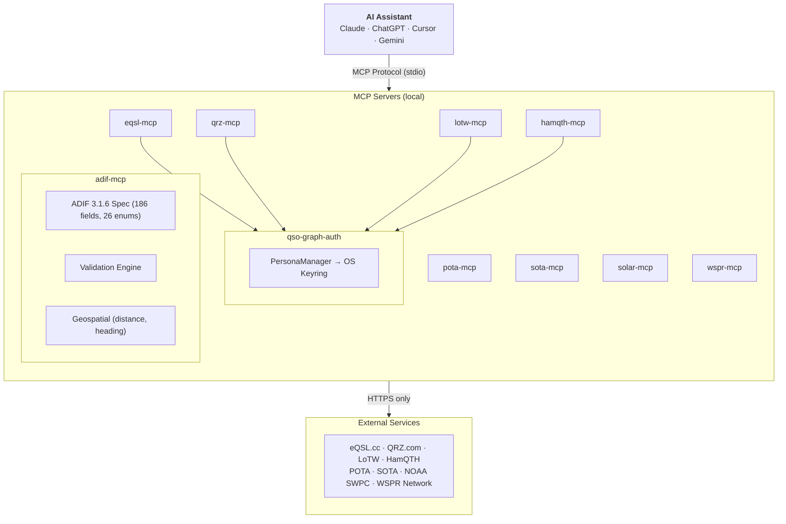

# Architecture

**How QSO-Graph servers work together — two foundation packages, nine MCP servers, zero cloud dependencies.**

---

## System Overview



---

## Foundation: qso-graph-auth + adif-mcp

Two foundation packages provide the shared capabilities that other servers depend on.

### qso-graph-auth — Credential Management

Named identities (personas) with credentials stored in the OS keyring. One persona serves all services:

```
Persona: "ki7mt"
  ├── eqsl    → password in OS keyring
  ├── lotw    → password in OS keyring
  ├── qrz     → password in OS keyring
  └── hamqth  → password in OS keyring
```

When a server needs credentials, it calls `qso-graph-auth` which reads them from the keyring at runtime. Credentials never exist in config files, environment variables, or MCP protocol messages.

```bash
pip install qso-graph-auth
qso-auth persona add --name ki7mt --callsign KI7MT --start 2020-01-01
qso-auth creds set ki7mt eqsl
```

### adif-mcp — ADIF 3.1.6 Spec Engine

The complete ADIF 3.1.6 spec bundled as JSON:

- **186 fields** with data types, valid ranges, and descriptions
- **26 enumerations** with 4,427+ records (Mode, Band, DXCC, Country, Contest_ID, etc.)
- **28 data types** (Number, String, Date, GridSquare, etc.)

Plus validation, parsing, and geospatial tools. See [adif-mcp](servers/adif-mcp.md) for the full 8-tool reference.

### Validation Engine

Record validation against the full spec:

- Field name recognition (186 fields)
- Data type checking (Number, Date, etc.)
- Enum membership checking (43 enum-typed fields across 26 enumerations)
- Compound format parsing (CreditList, multi-medium)
- Conditional validation (Submode depends on Mode)
- Import-only detection (warn, don't reject historical data)

---

## Server Architecture

Each MCP server follows the same pattern:

```
MCP Client Request
  │
  ▼
Input Validation ──── Regex on all user strings
  │
  ▼
Rate Limiter ──────── Per-service throttle (prevents account bans)
  │
  ▼
Credential Lookup ─── OS keyring via qso-graph-auth (authenticated servers only)
  │
  ▼
API Call ──────────── HTTPS only, response parsed
  │
  ▼
Response Cache ────── In-memory TTL cache
  │
  ▼
Safe Return ───────── No credentials in results, errors, or logs
```

### Common Properties

| Property | Value |
|----------|-------|
| Transport | stdio (default) or `--transport streamable-http` for MCP Inspector |
| Framework | FastMCP 3.x |
| Python | 3.10+ |
| License | GPL-3.0-or-later |
| Mock mode | `<NAME>_MCP_MOCK=1` for testing without credentials |

### Rate Limiting

Each server implements rate limiting appropriate for its service:

| Server | Min Delay | Max Rate | Notes |
|--------|-----------|----------|-------|
| eqsl-mcp | 500ms | — | Respectful crawl |
| qrz-mcp | 500ms | 35/min | IP ban risk above 35/min |
| lotw-mcp | 500ms | — | Respectful crawl |
| hamqth-mcp | 500ms | — | XML session rate limit |
| pota-mcp | 100ms | — | Public API |
| sota-mcp | 200ms | — | Public API |
| solar-mcp | 200ms | — | NOAA public data |
| wspr-mcp | 200ms | — | Public API |

---

## Credential Flow

Credentials take one path and never deviate:

```
User ──── qso-auth creds set ──── OS Keyring (encrypted)
                                       │
MCP Server ──── qso-graph-auth read ───┘
    │                                (in-process, never serialized)
    ▼
HTTPS Request ──── credential in Authorization header
    │
    ▼
Response ──── parsed, credential stripped
    │
    ▼
MCP Tool Result ──── data only, no credentials
```

**What gets persisted:** Nothing. Credentials exist in memory only during the API call. The OS keyring handles encryption at rest.

**What the AI sees:** Tool parameters (`persona`, `callsign`, `band`) and tool results (lookup data, QSO records). Never passwords, API keys, or session tokens.

---

## Package Independence

Each server is a standalone `pip install`:

```bash
pip install eqsl-mcp    # just eqsl-mcp + its dependencies
pip install pota-mcp     # just pota-mcp, no auth needed
```

Servers don't depend on each other. You can install one or all ten.

Authenticated servers depend on `qso-graph-auth` for credential management. Public servers (POTA, SOTA, IOTA, Solar, WSPR) have no dependency on qso-graph-auth.

---

## MCP Client Configuration

All servers work with any MCP client. Example for Claude Desktop:

```json
{
  "mcpServers": {
    "adif": {
      "command": "adif-mcp"
    },
    "eqsl": {
      "command": "eqsl-mcp"
    },
    "pota": {
      "command": "pota-mcp"
    }
  }
}
```

For Claude Code, add to `~/.claude/settings.json`:

```json
{
  "mcpServers": {
    "adif": { "command": "adif-mcp", "args": [] },
    "eqsl": { "command": "eqsl-mcp", "args": [] }
  }
}
```

See [Getting Started](getting-started.md) for configuration for all 6 supported MCP clients.

---

## Design Principles

### Good Neighbor Policy

QSO-Graph servers **wrap** external APIs — they don't replicate them. Rate limiting is built in to prevent account bans. If a service goes down, the server fails gracefully.

### Read-Only Security Model

No QSO-Graph server writes to external services. All operations are read-only: lookups, downloads, queries. No log uploads, no QSO submissions, no account modifications.

### Validate Before Upload

adif-mcp's validation engine catches data defects at the source. A busted QSO is not a confirmation — and a rare DXpedition contact may be irreplaceable. Validate before uploading to LoTW or eQSL.

### Pip Install and Go

Every server is one `pip install` away. No Docker, no containers, no config files (except MCP client config). Credentials go in the OS keyring, not YAML files.
